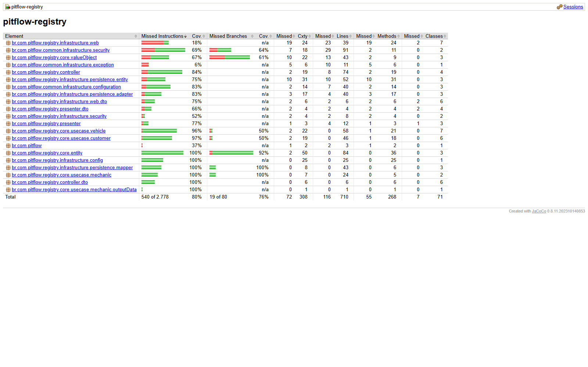

# PitFlow Registry

Microserviço responsável pelo cadastro e autenticação do domínio Registry:

- clientes;
- veículos;
- mecânicos;
- autenticação e emissão de JWT para mecânicos.

A qualidade do código é acompanhada continuamente pelo SonarQube Cloud.

## Stack

- Java 21;
- Spring Boot 4;
- Spring Data JPA;
- Spring Security e JWT;
- PostgreSQL;
- Liquibase;
- Maven;
- Kubernetes.

## Responsabilidade e limites

O Registry é o proprietário dos dados cadastrais de clientes, veículos e
mecânicos e da autenticação dos mecânicos. Outros serviços acessam essas
informações exclusivamente pelas APIs do Registry; nenhum serviço deve acessar
seu PostgreSQL diretamente.

Ordens de serviço, catálogo/estoque, pagamentos e estado da SAGA pertencem,
respectivamente, a Operation, Inventory, Payment e Orchestrator.

## Arquitetura

O código segue Clean Architecture:

```text
core            regras de negócio, entidades, value objects, portas e casos de uso
controller      tradução entre DTOs e casos de uso
presenter       respostas da aplicação
infrastructure  HTTP, segurança, JWT, JPA, PostgreSQL e configuração Spring
```

## Swagger e OpenAPI

- [Swagger publicado](https://85ufbygqvi.execute-api.us-east-1.amazonaws.com/registry/swagger-ui/index.html)
- [OpenAPI publicado](https://85ufbygqvi.execute-api.us-east-1.amazonaws.com/registry/v3/api-docs)
- Swagger local: `http://localhost:8080/registry/swagger-ui/index.html`
- OpenAPI local: `http://localhost:8080/registry/v3/api-docs`

Os links publicados foram validados com HTTP 200 em 27/07/2026.

## Execução local

Configuração:

| Variável | Padrão | Obrigatória |
|---|---|---|
| `DB_HOST` | `localhost` | não |
| `DB_PORT` | `5432` | não |
| `DB_NAME` | `pitflow-registry-db` | não |
| `DB_USERNAME` | `pitflow_registry` | não |
| `DB_PASSWORD` | — | sim |
| `JWT_SECRET` | — | sim |
| `DATADOG_ENABLED` | `false` | não |
| `DATADOG_API_KEY` | vazio | somente com Datadog habilitado |

Execução mais simples, com aplicação e PostgreSQL:

```bash
docker compose up --build
```

Endpoints locais pelo Compose:

- API: `http://localhost:18081/registry`;
- Swagger: `http://localhost:18081/registry/swagger-ui/index.html`;
- health: `http://localhost:18081/registry/actuator/health`.

Para encerrar:

```bash
docker compose down
```

O volume do PostgreSQL é preservado. Para uma recriação intencional dos dados
locais, use `docker compose down -v`.

Build e testes:

```bash
./mvnw clean verify
```

O build possui gate JaCoCo e falha se a cobertura total de linhas ficar abaixo
de 80%. O relatório HTML é gerado em:

```text
target/site/jacoco/index.html
```

Execução:

```bash
./mvnw spring-boot:run
```

## Qualidade e cobertura

Linha de base validada em 27/07/2026:

| Métrica JaCoCo | Resultado |
|---|---:|
| Linhas | **83,66%** |
| Instruções | **80,56%** |
| Branches | 76,25% |
| Testes | 87 aprovados |

O requisito e o gate deste serviço usam cobertura de **linhas**, com mínimo de
80%. A pipeline executa `./mvnw -B clean verify`, aplica `jacoco:check` e publica
o relatório HTML e os resultados dos testes no artefato
`registry-jacoco-<commit-sha>`.



## Banco de dados

O serviço utiliza o banco lógico `pitflow-registry-db`. As chaves esperadas no
secret `pitflow/bootstrap` são:

```text
PITFLOW_REGISTRY_DB_HOST
PITFLOW_REGISTRY_DB_PORT
PITFLOW_REGISTRY_DB_NAME
PITFLOW_REGISTRY_DB_USERNAME
PITFLOW_REGISTRY_DB_PASSWORD
```

As migrations deste repositório criam somente as tabelas `customer`, `vehicle`
e `mechanics`.

## Container e ECR

O projeto utiliza o ECR compartilhado indicado por `ECR_URL`. As imagens seguem
a convenção:

```text
registry-<commit-sha>
```

## Kubernetes

O pipeline aplica:

- recursos no namespace compartilhado `pitflow`;
- `ConfigMap` e `Secret` próprios;
- `Deployment`;
- `Service` do tipo `ClusterIP`;
- `HPA`;
- `Ingress` de classe `alb`.

A rota `/registry` participa do grupo compartilhado `pitflow` criado pelo AWS
Load Balancer Controller.

Health check:

```text
/registry/actuator/health
```

## CI/CD e observabilidade

O workflow independente executa build, 87 testes, gate JaCoCo, publicação do
relatório, imagem ECR e rollout no EKS. As tags seguem
`registry-<commit-sha>`; uma execução repetida reutiliza a imagem imutável.

No Kubernetes, logs, métricas e traces são enviados ao Datadog. O serviço
também expõe health e métricas pelo Actuator.

## Limites do serviço

O Registry não gerencia ordens, peças, serviços de oficina, pagamentos ou a
SAGA. Alterações de contrato devem permanecer compatíveis com os consumidores e
ser refletidas no OpenAPI.
